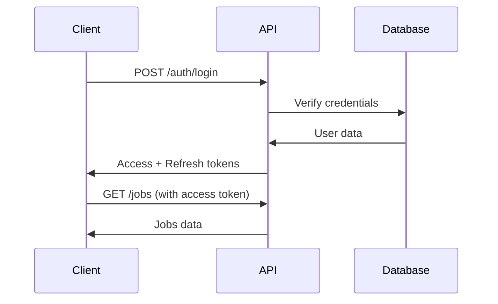
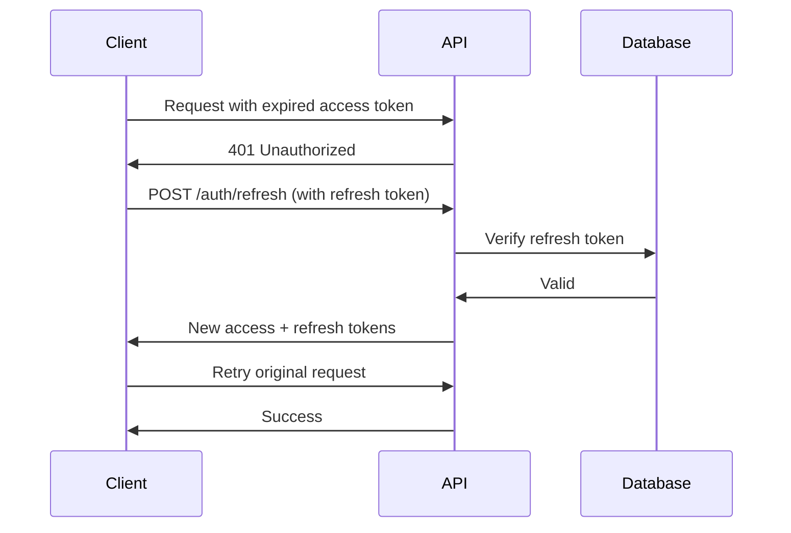

# Authentication API

The Authentication API handles user registration, login, password management, multi-factor authentication (MFA), and OAuth integration.

## Base Path

```
/auth
```

## Endpoints

### Register New User

Create a new user account.

**Endpoint:** `POST /auth/register`

**Rate Limit:** 5 requests per minute

**Authentication:** Not required

**Request Body:**
```json
{
  "email": "john.doe@example.com",
  "password": "SecurePass123!",
  "firstName": "John",
  "lastName": "Doe",
  "username": "johndoe",
  "phoneNumber": "+1234567890"
}
```

**Parameters:**

| Field | Type | Required | Description |
|-------|------|----------|-------------|
| email | string | Yes | Valid email address |
| password | string | Yes | Min 8 chars, must include uppercase, lowercase, number, and special character |
| firstName | string | No | Max 50 characters |
| lastName | string | No | Max 50 characters |
| username | string | No | 3-30 chars, alphanumeric, underscore, hyphen only |
| phoneNumber | string | No | E.164 format (e.g., +1234567890) |

**Success Response (201 Created):**
```json
{
  "accessToken": "eyJhbGciOiJIUzI1NiIsInR5cCI6IkpXVCJ9...",
  "refreshToken": "eyJhbGciOiJIUzI1NiIsInR5cCI6IkpXVCJ9...",
  "tokenType": "Bearer",
  "expiresIn": 900,
  "user": {
    "id": "123e4567-e89b-12d3-a456-426614174000",
    "email": "john.doe@example.com",
    "username": "johndoe",
    "firstName": "John",
    "lastName": "Doe",
    "role": "user",
    "status": "active",
    "isEmailVerified": false,
    "isMfaEnabled": false
  }
}
```

**Error Responses:**
- `400 Bad Request` - Invalid input data
- `409 Conflict` - User already exists

**cURL Example:**
```bash
curl -X POST https://api.jobpilot.com/auth/register \
  -H "Content-Type: application/json" \
  -d '{
    "email": "john.doe@example.com",
    "password": "SecurePass123!",
    "firstName": "John",
    "lastName": "Doe"
  }'
```

---

### Login

Authenticate user and receive access tokens.

**Endpoint:** `POST /auth/login`

**Rate Limit:** 10 requests per minute

**Authentication:** Not required

**Request Body:**
```json
{
  "email": "john.doe@example.com",
  "password": "SecurePass123!",
  "mfaToken": "123456"
}
```

**Parameters:**

| Field | Type | Required | Description |
|-------|------|----------|-------------|
| email | string | Yes | User email address |
| password | string | Yes | User password |
| mfaToken | string | No | Required if MFA is enabled (6-digit code) |

**Success Response (200 OK):**
```json
{
  "accessToken": "eyJhbGciOiJIUzI1NiIsInR5cCI6IkpXVCJ9...",
  "refreshToken": "eyJhbGciOiJIUzI1NiIsInR5cCI6IkpXVCJ9...",
  "tokenType": "Bearer",
  "expiresIn": 900,
  "user": {
    "id": "123e4567-e89b-12d3-a456-426614174000",
    "email": "john.doe@example.com",
    "username": "johndoe",
    "firstName": "John",
    "lastName": "Doe",
    "role": "user",
    "status": "active",
    "isEmailVerified": true,
    "isMfaEnabled": false
  }
}
```

**Error Responses:**
- `401 Unauthorized` - Invalid credentials, account locked, or MFA required

**cURL Example:**
```bash
curl -X POST https://api.jobpilot.com/auth/login \
  -H "Content-Type: application/json" \
  -d '{
    "email": "john.doe@example.com",
    "password": "SecurePass123!"
  }'
```

---

### Logout

Invalidate current user session and tokens.

**Endpoint:** `POST /auth/logout`

**Authentication:** Required (Bearer token)

**Request Body:** None

**Success Response (200 OK):**
```json
{
  "message": "Logged out successfully"
}
```

**Error Responses:**
- `401 Unauthorized` - Invalid or expired token

**cURL Example:**
```bash
curl -X POST https://api.jobpilot.com/auth/logout \
  -H "Authorization: Bearer YOUR_ACCESS_TOKEN"
```

---

### Refresh Token

Get a new access token using refresh token.

**Endpoint:** `POST /auth/refresh`

**Rate Limit:** 20 requests per minute

**Authentication:** Refresh token required

**Request Body:**
```json
{
  "refreshToken": "eyJhbGciOiJIUzI1NiIsInR5cCI6IkpXVCJ9..."
}
```

**Success Response (200 OK):**
```json
{
  "accessToken": "eyJhbGciOiJIUzI1NiIsInR5cCI6IkpXVCJ9...",
  "refreshToken": "eyJhbGciOiJIUzI1NiIsInR5cCI6IkpXVCJ9...",
  "tokenType": "Bearer",
  "expiresIn": 900,
  "user": {
    "id": "123e4567-e89b-12d3-a456-426614174000",
    "email": "john.doe@example.com"
  }
}
```

**Error Responses:**
- `401 Unauthorized` - Invalid refresh token

**cURL Example:**
```bash
curl -X POST https://api.jobpilot.com/auth/refresh \
  -H "Content-Type: application/json" \
  -d '{
    "refreshToken": "YOUR_REFRESH_TOKEN"
  }'
```

---

### Forgot Password

Request password reset email.

**Endpoint:** `POST /auth/forgot-password`

**Rate Limit:** 3 requests per minute

**Authentication:** Not required

**Request Body:**
```json
{
  "email": "john.doe@example.com"
}
```

**Success Response (200 OK):**
```json
{
  "message": "If an account exists with this email, a password reset link has been sent"
}
```

**Note:** For security, the same response is returned whether the email exists or not.

**cURL Example:**
```bash
curl -X POST https://api.jobpilot.com/auth/forgot-password \
  -H "Content-Type: application/json" \
  -d '{
    "email": "john.doe@example.com"
  }'
```

---

### Reset Password

Reset password using token from email.

**Endpoint:** `POST /auth/reset-password`

**Rate Limit:** 5 requests per minute

**Authentication:** Not required

**Request Body:**
```json
{
  "token": "reset-token-from-email",
  "password": "NewSecurePass123!"
}
```

**Success Response (200 OK):**
```json
{
  "message": "Password reset successfully"
}
```

**Error Responses:**
- `400 Bad Request` - Invalid or expired token

**cURL Example:**
```bash
curl -X POST https://api.jobpilot.com/auth/reset-password \
  -H "Content-Type: application/json" \
  -d '{
    "token": "reset-token-from-email",
    "password": "NewSecurePass123!"
  }'
```

---

### Verify Email

Verify email address using token.

**Endpoint:** `POST /auth/verify-email`

**Rate Limit:** 10 requests per minute

**Authentication:** Not required

**Request Body:**
```json
{
  "token": "verification-token-from-email"
}
```

**Success Response (200 OK):**
```json
{
  "message": "Email verified successfully"
}
```

**Error Responses:**
- `400 Bad Request` - Invalid or expired token

**cURL Example:**
```bash
curl -X POST https://api.jobpilot.com/auth/verify-email \
  -H "Content-Type: application/json" \
  -d '{
    "token": "verification-token-from-email"
  }'
```

---

### Get Current User

Get authenticated user profile.

**Endpoint:** `GET /auth/me`

**Authentication:** Required (Bearer token)

**Success Response (200 OK):**
```json
{
  "id": "123e4567-e89b-12d3-a456-426614174000",
  "email": "john.doe@example.com",
  "username": "johndoe",
  "firstName": "John",
  "lastName": "Doe",
  "phoneNumber": "+1234567890",
  "profilePicture": "https://cdn.jobpilot.com/profiles/...",
  "role": "user",
  "status": "active",
  "authProvider": "local",
  "isEmailVerified": true,
  "isMfaEnabled": false,
  "lastLoginAt": "2025-12-01T10:30:00Z",
  "createdAt": "2025-01-15T08:00:00Z",
  "updatedAt": "2025-12-01T10:30:00Z"
}
```

**cURL Example:**
```bash
curl -X GET https://api.jobpilot.com/auth/me \
  -H "Authorization: Bearer YOUR_ACCESS_TOKEN"
```

---

## OAuth Authentication

### Google OAuth Login

Initiate Google OAuth flow.

**Endpoint:** `GET /auth/google`

**Authentication:** Not required

This endpoint redirects to Google's OAuth consent screen. After authorization, Google redirects back to the callback URL.

**Redirect URL:**
```
https://api.jobpilot.com/auth/google/callback
```

**Usage:**
```html
<a href="https://api.jobpilot.com/auth/google">Login with Google</a>
```

---

### Google OAuth Callback

Handle Google OAuth callback.

**Endpoint:** `GET /auth/google/callback`

**Authentication:** Not required (handled by OAuth flow)

**Success Response (200 OK):**
```json
{
  "accessToken": "eyJhbGciOiJIUzI1NiIsInR5cCI6IkpXVCJ9...",
  "refreshToken": "eyJhbGciOiJIUzI1NiIsInR5cCI6IkpXVCJ9...",
  "tokenType": "Bearer",
  "expiresIn": 900,
  "user": {
    "id": "123e4567-e89b-12d3-a456-426614174000",
    "email": "john.doe@gmail.com",
    "authProvider": "google"
  }
}
```

---

## Multi-Factor Authentication (MFA)

### Setup MFA

Initiate MFA setup for current user.

**Endpoint:** `POST /auth/mfa/setup`

**Authentication:** Required (Bearer token)

**Request Body:** None

**Success Response (200 OK):**
```json
{
  "secret": "JBSWY3DPEHPK3PXP",
  "qrCode": "data:image/png;base64,iVBORw0KGgoAAAANSUhEUg...",
  "otpauthUrl": "otpauth://totp/JobPilot:john.doe@example.com?secret=JBSWY3DPEHPK3PXP&issuer=JobPilot"
}
```

**Usage:**
1. Display QR code to user
2. User scans with authenticator app (Google Authenticator, Authy, etc.)
3. User verifies with generated code using `/auth/mfa/verify`

**cURL Example:**
```bash
curl -X POST https://api.jobpilot.com/auth/mfa/setup \
  -H "Authorization: Bearer YOUR_ACCESS_TOKEN"
```

---

### Verify and Enable MFA

Verify MFA token and enable MFA for account.

**Endpoint:** `POST /auth/mfa/verify`

**Rate Limit:** 5 requests per minute

**Authentication:** Required (Bearer token)

**Request Body:**
```json
{
  "token": "123456"
}
```

**Success Response (200 OK):**
```json
{
  "message": "MFA enabled successfully"
}
```

**Error Responses:**
- `400 Bad Request` - MFA not setup
- `401 Unauthorized` - Invalid MFA token

**cURL Example:**
```bash
curl -X POST https://api.jobpilot.com/auth/mfa/verify \
  -H "Authorization: Bearer YOUR_ACCESS_TOKEN" \
  -H "Content-Type: application/json" \
  -d '{
    "token": "123456"
  }'
```

---

### Disable MFA

Disable MFA for current user.

**Endpoint:** `POST /auth/mfa/disable`

**Authentication:** Required (Bearer token)

**Request Body:** None

**Success Response (200 OK):**
```json
{
  "message": "MFA disabled successfully"
}
```

**cURL Example:**
```bash
curl -X POST https://api.jobpilot.com/auth/mfa/disable \
  -H "Authorization: Bearer YOUR_ACCESS_TOKEN"
```

---

## JWT Token Structure

### Access Token

- **Type:** JWT
- **Expiration:** 15 minutes (900 seconds)
- **Payload:**
```json
{
  "userId": "123e4567-e89b-12d3-a456-426614174000",
  "email": "john.doe@example.com",
  "role": "user",
  "iat": 1640000000,
  "exp": 1640000900
}
```

### Refresh Token

- **Type:** JWT
- **Expiration:** 7 days
- **Storage:** Stored securely in database, invalidated on logout

## Authentication Flow

### Standard Flow



### Token Refresh Flow



## Security Best Practices

1. **Token Storage:**
   - Store access tokens in memory
   - Store refresh tokens in httpOnly cookies or secure storage
   - Never store tokens in localStorage

2. **Token Transmission:**
   - Always use HTTPS
   - Include tokens in Authorization header: `Bearer YOUR_TOKEN`

3. **Token Rotation:**
   - Implement automatic token refresh before expiration
   - Rotate refresh tokens on each use

4. **Rate Limiting:**
   - Respect rate limits to avoid account lockout
   - Implement exponential backoff on failures

5. **MFA:**
   - Enable MFA for enhanced security
   - Store backup codes securely

## Error Codes

| Code | Description |
|------|-------------|
| AUTH001 | Invalid credentials |
| AUTH002 | Account locked due to multiple failed attempts |
| AUTH003 | Email not verified |
| AUTH004 | MFA token required |
| AUTH005 | Invalid MFA token |
| AUTH006 | Token expired |
| AUTH007 | Invalid refresh token |
| AUTH008 | User already exists |
| AUTH009 | Invalid password reset token |
| AUTH010 | Invalid email verification token |

See [Error Codes](./errors.md) for complete error documentation.
